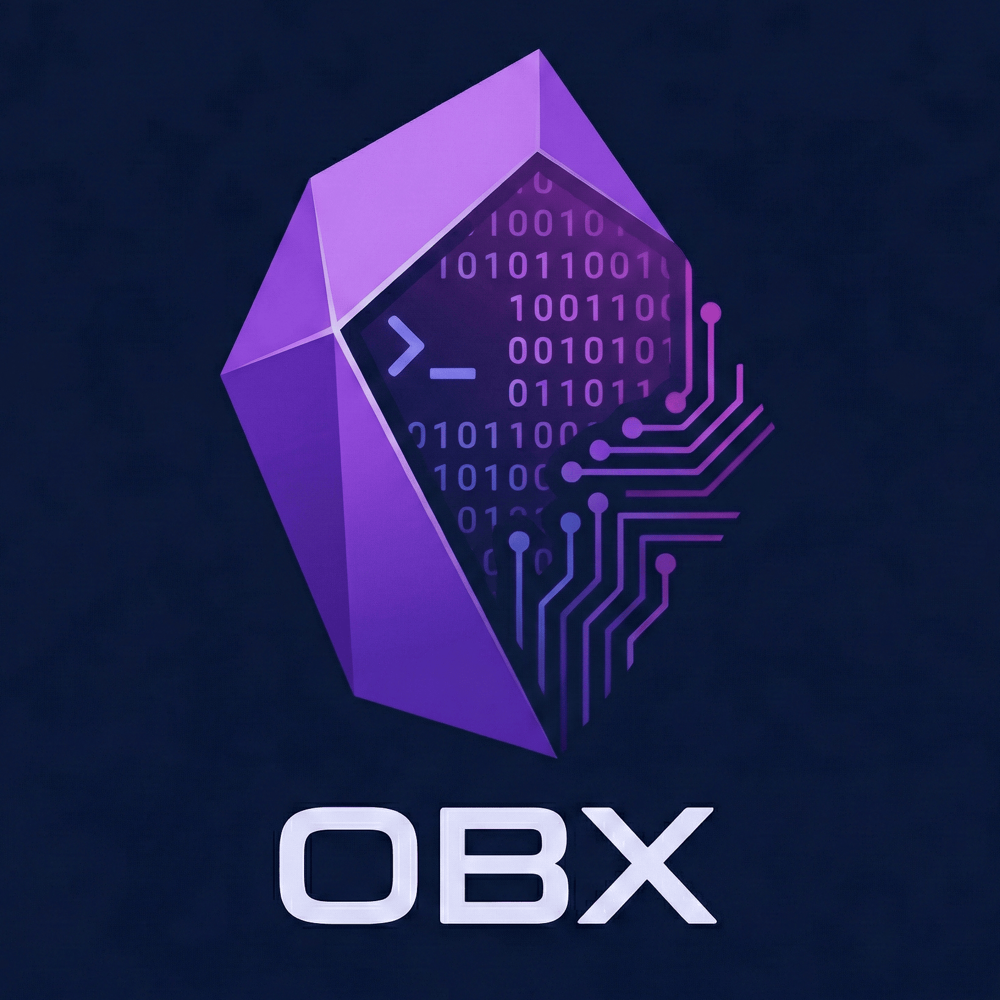

<p align="center">
  
</p>

# obx

**obx** is an AI-native CLI for Obsidian.md that blends direct file manipulation with semantic intelligence. It serves as a direct bridge between your terminal and your local Vault, utilizing a modern, lightweight AI stack.

## Installation

### Option 1: Development (Recommended for now)
If you are developing or testing `obx` locally:

```bash
# Initialize
uv sync

# Run commands
uv run obx --help
```

### Option 2: Install as a Tool (Global Usage)
To use `obx` directly without `uv run`:

```bash
uv tool install .
```

Now you can run:
```bash
obx chat
```
*(Ensure `~/.local/bin` or equivalent is in your PATH)*

## Configuration

Before using AI features, run the setup wizard:

```bash
obx config
```
This will ask for:
1.  **Obsidian Vault Path**: The absolute path to your notes.
2.  **API Keys**: Google Gemini (recommended/default), OpenAI, or Anthropic.

Settings are stored in `~/.obx/.env`.

## Features

- **Chat**: Interactive agent knowing your vault (`obx chat`)
- **Semantic Search**: Find related notes concept-first (`obx explain "topic"`)
- **Fuzzy Find**: Quickly path files (`obx find "note name"`)
- **Direct IO**: Read (`obx read`) and Open (`obx open`) notes.

## Tech Stack
- **Engine**: `pydantic-ai` + `Typer`
- **RAG**: `txtai` + `chonkie`
- **Package Manager**: `uv`

## Project Structure
`src/obx/`
- `cli/`: Command-line interface and commands.
- `core/`: Configuration and core abstractions.
- `rag/`: RAG engine and indexing logic.
- `agents/`: AI agent implementations (Chat, Explain, Guide, Editor).
- `utils/`: Shared utilities (UI, Filesystem, Diff).
